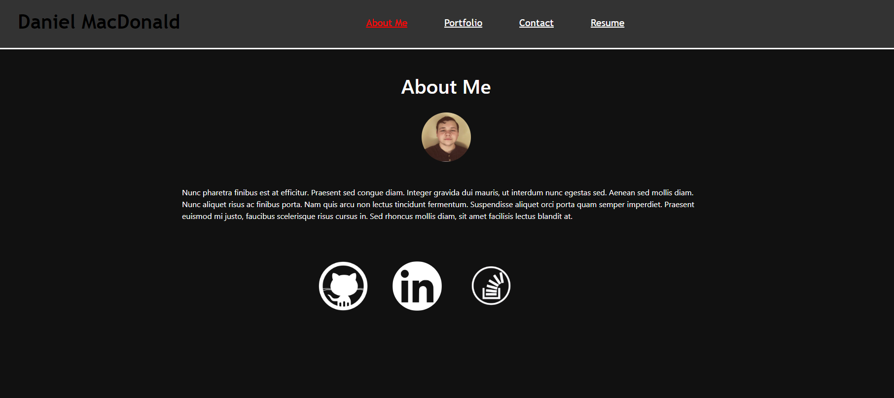

# Portfolio

## Description
This is my updated portfolio site built using react. It contains a short bio, links to my github and linkedin, and a portfolio page with links to my projects. There is also a contact page with a form to send me an email. On the resume page you can download the list of techs I am proficient with. The site is deployed to netlify and can be found [here](https://danmacportfolio.netlify.app/#about).

